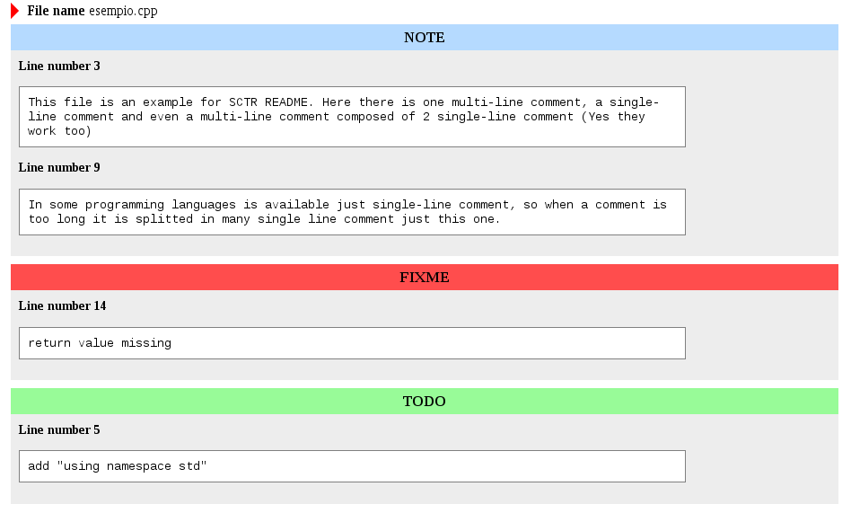

SCTR (Source Code Tags Report)
==============================

SCTR is a tool used to gather in a HTML file all comments with a tag used as
 reminder without the burden of opening the file/s and look into it/them. It
allows the user even to specify its own personal tags and also use a custom
template for the HTML report satisfying its own needs. For each file   there is
a list of comments divided by tag.

 The most used tags are :

- **FIXME** to mark potential problematic code that requires special attention
and/or review.
- **NOTE** to document inner workings of code and indicate potential pitfalls.
- **TODO** to indicate planned enhancements.
- **XXX** to warn other programmers of problematic or misguiding code.

**NOTE:** Tags description are taken from
http://en.wikipedia.org/wiki/Comment_(computer_programming)#Tags

Here an example of code and the result as screenshots

    #include <iostream>

    /* NOTE
       This file is an example for SCTR README.
       Here there is one multi-line comment, a single-line comment and even
       a multi-line comment composed of 2 single-line comment
       (Yes they work too)
    */

    // TODO add "using namespace std"

    int main(void)
    {
        // NOTE In some programming languages is available just single-line
        // comment, so when a comment is too long it is splitted in many
        // single line comment just this one.

        // why everyone greet the world? Be nice and greet yourself :)
        cout<<"Hello developer!!"<<endl;

        // FIXME return value missing
        return ;
    }

Requirements
------------
You need to have _argparse_ installed on your machine.

**Debian/Ubuntu**

    apt-get install python-argparse

**Fedora**

    yum install python-argparse

**Generic/Virtualenv**

    pip install argparse

Or see the argparse [page](https://pypi.python.org/pypi/argparse).

Usage
--------

Parse a single file

    ./SCTR.py -i example.cpp

if you want parse a directory recursevely

    ./SCTR.py -r -i project_K/

*Note:* By default the output file will be report.html, if you want change the 
name use -o <FILENAME> option or change the configuration file.

####Options

       -h, --help            show this help message and exit
       -v, --version         show program's version number and exit
       -o FILENAME, --output FILENAME Name of the html output file
       -i FILENAME or DIR_NAME, --input 	FILENAME or DIRNAME Name of the
file/directory that should be processed
       -r, --recursive       If the input is a directory scan the directories
recursively
       -t FILENAME, --template FILENAME
                        Name of the template you want to use

    usage: SCTR.py [-h] [-v] [-o FILENAME] [-i FILENAME or DIR_NAME] [-r]
                         [-t FILENAME]

    optional arguments: -t, -r, -o

Configuration file
------------------

the configuration file is a json, the basic version can be see below.

    {
        "output": "report.html",
        "template": "templates/template.html",
        "tags": ["TODO", "NOTE", "FIXME", "XXX"],
        "exts": {  ".cpp" : ["//", "/*", "*/"],
                   ".js" : ["//", "/*", "*/"],
                   ".h" : ["//", "/*", "*/"],
                   ".py" : ["#", "", ""]
                }
    }

SCTR is configurable in order to let anyone to customize its needs, in fact is
possible to add tags, which files parse looking their extension, the template
that must be use and in the end even the report name. As showed above the
provided conf file let SCTR to recognize  *TODO*, *FIXME*, *NOTE*, *XXX* tags
and parse the files *.cpp*, *.h*, *.js*, *.py*.

The *exts* part describe both extensions file that must be parsed that how
recognize its comments. As you know different programming languages use
different way to specify a comment so is necessary

####How to add a new tag

It is enough to add it in the *tags* list in the configuration file.

####How to add a new extension file

As said before every programming language has its own way to define a comment,
some of them share the same way to define it i.e. JavaScript and C++. Some
languages support just a single line comment and other even multi line comment.
Below an example using C++ comments style.

    // Hi I'm a single line comment
    ...
    /* Instead I'm a multiline comment, I'm often used to write
       long comment which require many lines. In example for doc reasons.
    */

As you can see for each extension there is an array of 3 elements, the first is
for single line comment instead the other 2 are used to specify a multiline
comment. The presence of 2 elements for a multi line is needed because usually
there is a start part (i.e. /* ) and a end part (*/). Thus add a new file is 
quite simple, in fact you must add the extension and the chars used to specify
 the comment/s.
*REMEMBER: * the first must be the single line comment and then stad and end 
multi line comment chars.

How to create a template
------------------------

The script provides the data, through the variable *comments*, that feeds the
template file. The data has the following format.

    comments[filename_1][tag_name_1] <line_number, comment_body>
               .....
            [filename_N][tag_name_1] <line_number_A, comment_body>
                           ....          ....
                        [tag_name_M] <line_number_Z, comment_body>

*Comments* contains a list of the filenames where it was found at least one tag,
 for each tag we've a list of pair/tuple with line number where is the comment
and the comment itself. Below you can find an example of template that is even
the default template used by the script.

###Example

    <HTML>
      <head>
          <title>REPORT</title>
          <link href="css/style.css" rel="stylesheet" type="text/css">
      </head>
      <body>

        ${ for file in comments: }$
            

                File name </b> ${ file }$
            

            

                ${ for tag in comments[file]: }$
                    <h3 class="TAG ${ tag }$">${ tag }$</h3>
                    

                    ${ for line_number, comment_body in comments[file][tag]: }$
                        <b>Line number ${ line_number }$</b>
                        
${ comment_body }$

                    ${ :end-for }$
                    

                ${ :end-for }$
            

        ${ :end-for }$

      </body>
    </HTML>

**Note: ** The template engine used is [**templite**]
(http://www.joonis.de/en/code/templite).

Version
---------
0.9

Author
------

Alessandro Pischedda

Contact
-------
alessandro.pischedda@gmail.com

Credits
---------
Template Engine used  [**templite**](http://www.joonis.de/en/code/templite).

LICENSE
-----------
This software is distributed with the GPLv2. See the file LICENSE for more info.
